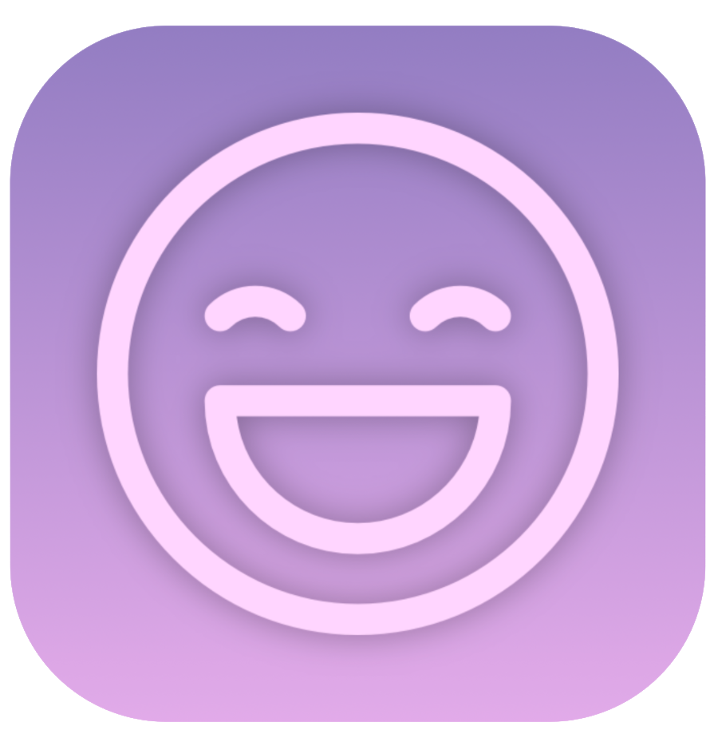

<h1 align="center">
 
  
   
     
  Sentimizer
   
</h1>
Sentimizer helps you to keep track of your activities and moods. It shows what you can do to improve your mood and productivity and enables you to get to know your habits.   

* [Backend Repository](https://github.com/JustGitEverything/Sentimizer)

* [Website Repository](https://github.com/samuelgin/Sentimizer-Website)

### Building

To open the project, clone it in [Xcode](https://developer.apple.com/xcode/) (minimum iOS Version 16.0).

